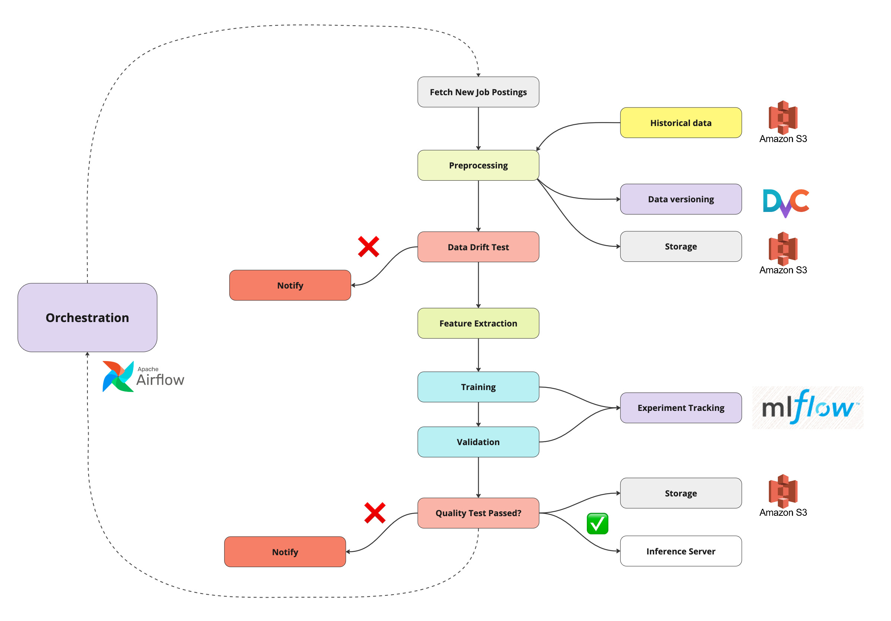
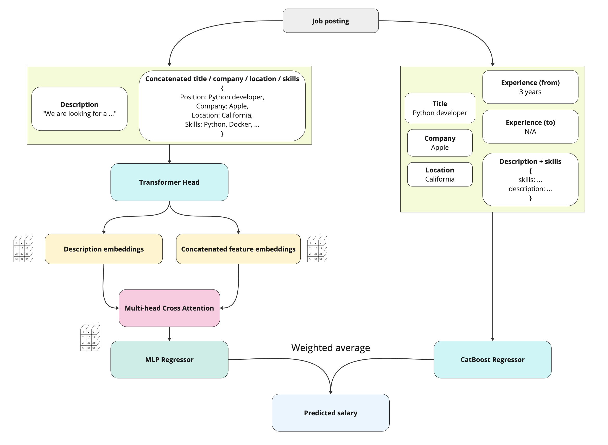

# Tech Salary Prediction Service

With the upcoming EU Pay Transparency Directive in 2026, understanding and predicting fair salary ranges is becoming increasingly crucial for businesses.

The service predicts salaries for IT job positions based on job descriptions and related metadata, offering a valuable tool for ensuring fair compensation practices.

The architecture involves a blended model of CatBoost and Transformer models for prediction that achieves state-of-the-art prediction accuracy.

The stack overview:

- **Python**, **FastAPI**, **Docker**, **AWS EC2** for backend;
- **Airflow** for orchestration;
- **MLflow** and **DVC** for tracking and data versioning;
- **AWS S3** for storage;
- **Next.js**, **TypeScript**, and **Vercel** for the frontend.
- **Streamlit** is also available as an alternative frontend.

The project is now live! [**Check it out at this link.**](https://tech-salary-prediction.vercel.app/)

## System Design Overview



## Model Architecture



## Codebase Structure

### Overview

```plaintext
dags/                 # Airflow DAGs for pipeline automation

.github/workflows     # GitHub Actions CI/CD workflows

backend/              # Python backend service
├── configs/          # Configuration files
├── src/              # Source code
│   ├── fastapi_app.py  # FastAPI application
│   ├── streamlit_app.py # Streamlit application
│   ├── feature_building   # Feature engineering
│   ├── monitoring         # Monitoring tools
│   ├── preprocessing      # Data preprocessing scripts
│   ├── scraping           # Web scraping scripts
│   ├── training           # Model training scripts
│   │   ├── catboost       # CatBoost model training
│   │   └── transformer  # Transformer model training
│   └── utils              # Utility functions
├── tests/            # Unit tests
└── docker/           # Docker configuration

frontend/             # Next.js frontend application
├── src/
│   ├── app/          # Next.js app directory
│   ├── components/
│   └── utils/        # Frontend helper functions

notebooks/            # Jupyter notebooks for experiments
```

### Experiments

```plaintext
notebooks
├── baselines              # Baseline models for comparison
│   ├── average.ipynb      # Simple average salary prediction
│   ├── bi_gru_cnn.ipynb   # Bi-directional GRU-CNN model
│   ├── catboost.ipynb     # CatBoost model
│   └── transformer.ipynb  # Transformer model
├── experiments            # Experimentation with different models and configurations
│   ├── double-bert-huber-loss-tsdae.ipynb       # pre-tuning the model with TSDAE
│   ├── double-bert-mse-loss.ipynb                # two separate encoders for textual features
│   ├── huber-loss-cross-attention-e5-mean-pooling.ipynb  # cross-attention for textual features, e5 model
│   ├── huber-loss-cross-attention.ipynb          # cross-attention for textual features, smaller model
│   ├── huber-loss-e5-mean-pooling.ipynb         # mean pooling instead of [CLS] pooling
│   ├── huber-loss-mask-pooling.ipynb             # pooling via [MASK] token embedding
│   └── huber-loss.ipynb                          # use of Huber loss instead of MSE
```


## Stack

**ML:**

- CatBoost
- PyTorch
- Transformers
- MLflow

**Data:**

- AWS S3
- DVC for data versioning

**Orchestration:**

- docker-compose
- Airflow

**Backend:**

- Python
- AWS EC2
- Docker
- GitHub Actions CI/CD
- Pytest

**Frontend:**

- Next.js
- TypeScript
- Vercel deployment
- Tailwind CSS
- Radix UI

## Getting Started

### Prerequisites

- Python 3.10+
- Node.js 18+
- Docker & Docker Compose
- AWS credentials for S3 storage with the following details:
  - `AWS_ACCESS_KEY_ID`
  - `AWS_SECRET_ACCESS_KEY`
  - `AWS_DEFAULT_REGION`

- Google Gemini API credentials for job description translation:
  - `GEMINI_API_KEY`
- Git access configured for CI/CD:
  - `GIT_EMAIL`
  - `GIT_NAME`
  - `GITHUB_TOKEN`
  - `GIT_REPO_URL`

### Backend Setup - Dependency Management

Before deploying the backend, choose one of the following dependency setups:

- **Blended Model (CatBoost & Transformer)**:
  1. Enable the transformer model in `backend/configs/params.yaml` by setting `models.transformer.enabled` to `true`.
  2. Replace the base `requirements.txt` file with the blended model requirements:

     ```bash
     cp backend/requirements_blended.txt backend/requirements.txt
     ```

- **CatBoost Only**:
  1. Disable the transformer model in `backend/configs/params.yaml` by setting `models.transformer.enabled` to `false`.
  2. Use the CatBoost-only requirements:

     ```bash
     cp backend/requirements_catboost.txt backend/requirements.txt
     ```

- **No ML (Minimal Dependencies)**:
  1. Use the minimal dependencies for a lighter setup (no ML models):

     ```bash
     cp backend/requirements_no_ml.txt backend/requirements.txt
     ```

### Backend Setup

1. Clone the repository:

```bash
git clone git@github.com:dm-shr/tech-salary-prediction.git
cd tech-salary-prediction
```

2. Set up environment variables:

```bash
cp .env.example .env
# Edit .env with your AWS credentials and other configurations
```

3. Start the backend services:

```bash
docker-compose up -d --build
```

4. (Optional) Set up ngrok for external access:

```bash
ngrok http 8000 # you may also specify the domain
```

**NOTE:** You would need to install [**ngrok**](https://ngrok.com/) for that.

### Frontend Setup

1. Development:

  ```bash
  cd frontend
  npm install
  cp frontend/.env.example frontend/.env.local
  # Edit .env.local with your configurations
  npm run dev
  ```

  After that, access the web interface at <http://localhost:3000>

2. Production:

  - Go to [**Vercel**](https://vercel.com/)
  - Connect your GitHub repository
  - Add environment variables in Vercel project settings

### DAG and ML Training Pipeline

1. After starting all services with Docker Compose, access the Airflow web UI at <http://localhost:8080>.
2. Log in with the default credentials (admin/admin).
3. Find the `tech_salary_prediction` DAG and unpause it.
4. Trigger the DAG to start the data processing and model training pipeline.
5. Monitor the DAG run in the Airflow UI.
6. Track the experiments and model performance using MLflow at <http://mlflow:5000> (default, can be set with `MLFLOW_TRACKING_URI`, `MLFLOW_S3_ENDPOINT_URL`, and `MLFLOW_EXPERIMENT_NAME` in `.env`)

## Data Source

Job postings are fetched from two major recruitment platforms,  [**HeadHunter**](https://hh.ru/)  and  [**GetMatch**](https://getmatch.ru/), using the respective APIs.

## Results Summary

The solution architecture involves a blended model that combines CatBoost and Transformer architectures.

Metrics (R² and MAE) are reported as a mean value ± 95% confidence intervals across three random seeds.

Overall state-of-the-art results are in **bold**, while the best results for a solo transformer model are in *italics*.

| Experiment | R² score | MAE |
|------------|----------|-----|
| Baselines | | |
| by average | 0.000 ± 0.000 | 0.513 ± 0.002 |
| Bi-GRU-CNN | 0.652 ± 0.012 | 0.288 ± 0.007 |
| CatBoost | 0.734 ± 0.005 | 0.248 ± 0.004 |
| cross-encoder transformer (29M) | 0.645 ± 0.027 | 0.289 ± 0.012 |
| Modifications | | |
|------------|----------|-----|
| bi-encoder transformer (29M) | 0.643 ± 0.024 | 0.291 ± 0.013 |
| + Huber loss + TSDAE | 0.657 ± 0.056 | 0.285 ± 0.024 |
|------------|----------|-----|
| cross-encoder transformer (29M) + Huber loss | 0.655 ± 0.035 | 0.286 ± 0.016 |
| + extra `[MASK]` pooling | 0.599 ± 0.034 | 0.313 ± 0.015 |
| *+ cross-attention* | *0.671 ± 0.027* | *0.279 ± 0.014* |
|------------|----------|-----|
| cross-encoder transformer (118M) + Huber loss | 0.723 ± 0.024 | 0.254 ± 0.013 |
| *+ cross-attention* | *0.729 ± 0.017* | *0.251 ± 0.009* |
| **+ CatBoost blending** | **0.770 ± 0.001** | **0.229 ± 0.003** |
| + cross-attention + CatBoost | 0.769 ± 0.014 | 0.229 ± 0.01 |

## Authors info

**Dmitrii Shiriaev:**

- Backend / Frontend
- Deployment
- Data / ML / inference pipeline
- Transformer experiments
- CatBoost experiments

**Eugene Romanov:**

- Exploratory Data Analysis

**George Besedin:**

- Bi-GRU-CNN baseline

All authors contributed in writing the report manuscript.

## License

This project is licensed under the MIT License - see the LICENSE file for details.
